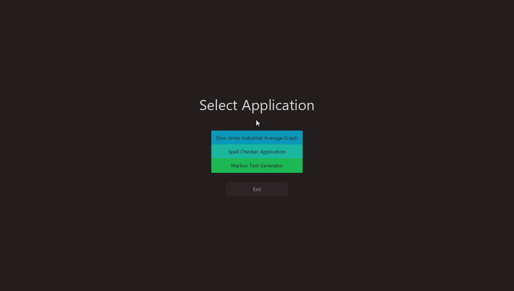
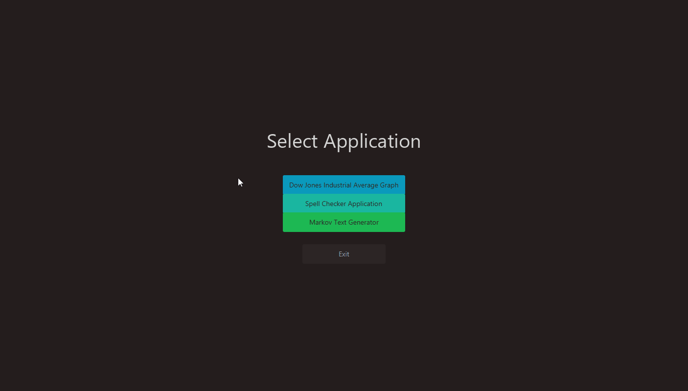
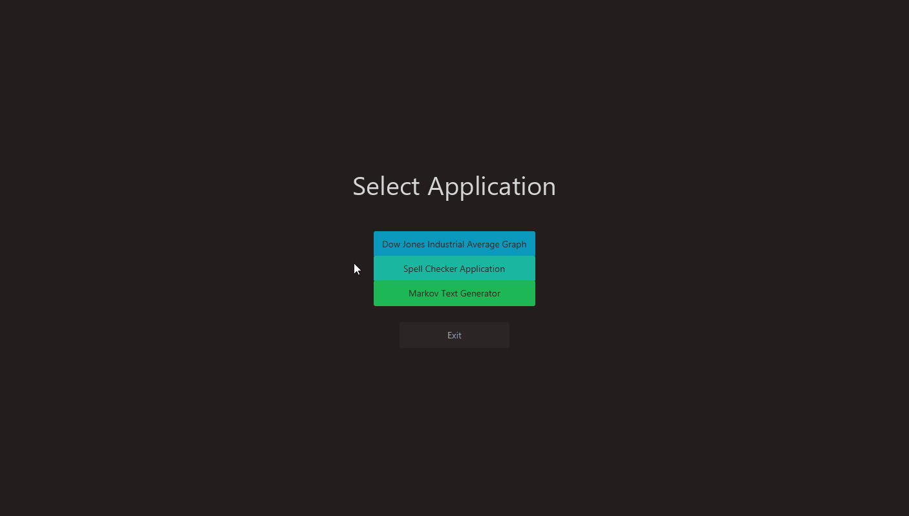
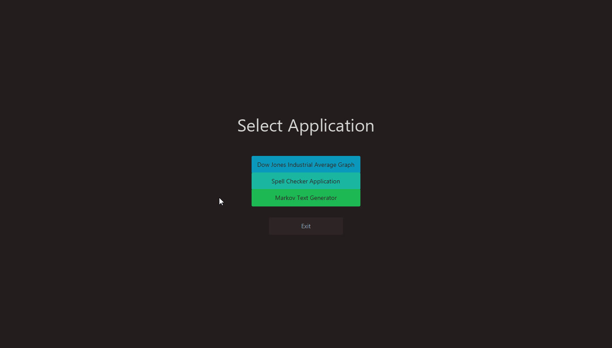
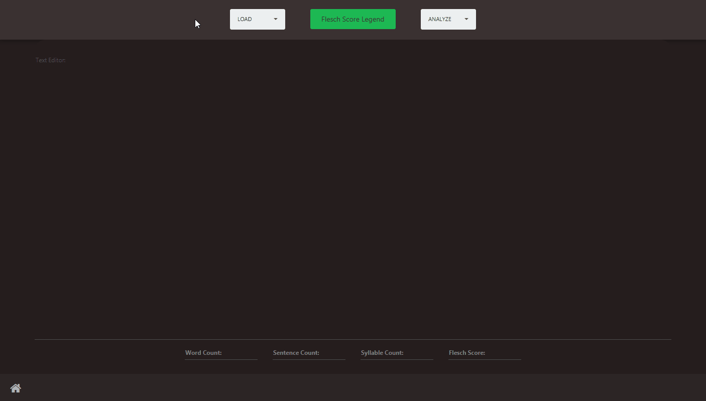
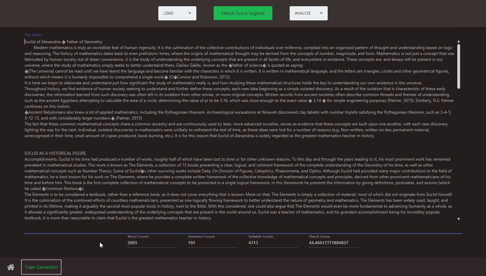

# Data Structures Demo App

Suite of applications building further upon the final project of a Data Structures + Java Programming course.

## **Features**

|           | Description |
| --------- | ----------- |
| Dow Jones Graph                | Display a graph of Dow Jones Industrial Average data from 2007-2017. Click and drag on the graph to zoom in on a segment. Enter a date at the top to search for the value on that date. |
| Spell Checker                  | Train a spell checker using a word probability database file. The spell checker will then recognize any word that is spelled correctly, or indicate that the current word is spelled incorrectly, and suggest the closest matching word to replace it. |
| Text Analyzer/Generator | Text Editor capable of the following: <ul><li>Import a text file.</li><li>Analyze a body of text for the word, sentence, and syllable count.</li><li>Using the analyzed data, calculate the Flesh (readability) Score of the text.</li><li>Interpret the reading level of the text using the Flesch Score Legend.</li><li>Train a Markov Chain text generator using an imported text file.</li><li>Generate a specified number of words inside of the editor using the trained generator.</li></ul> |
  

---

## **Dow Jones Graph**

## **Spell Checker**

## **Text Analyzer/Generator**

* ### Using the Editor

* ### Analyzing Text

* ### Training the Generator and Generating New Text

---
